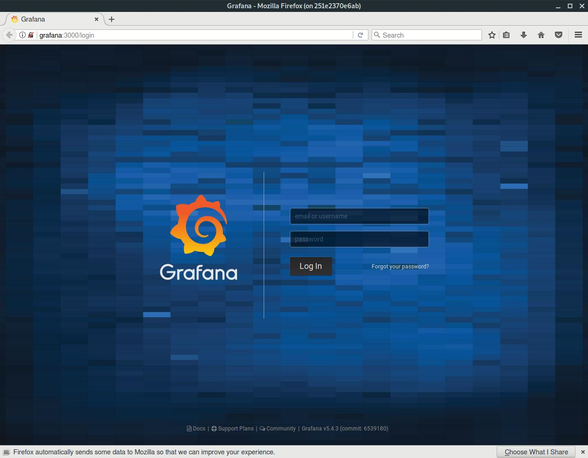
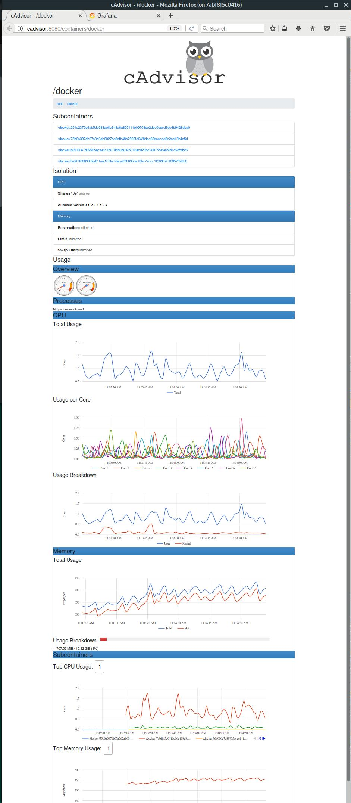
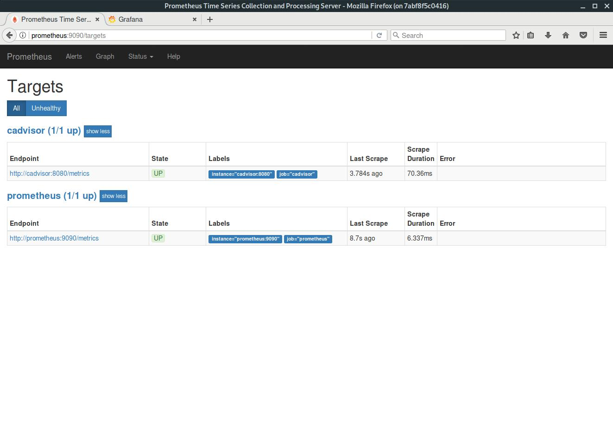
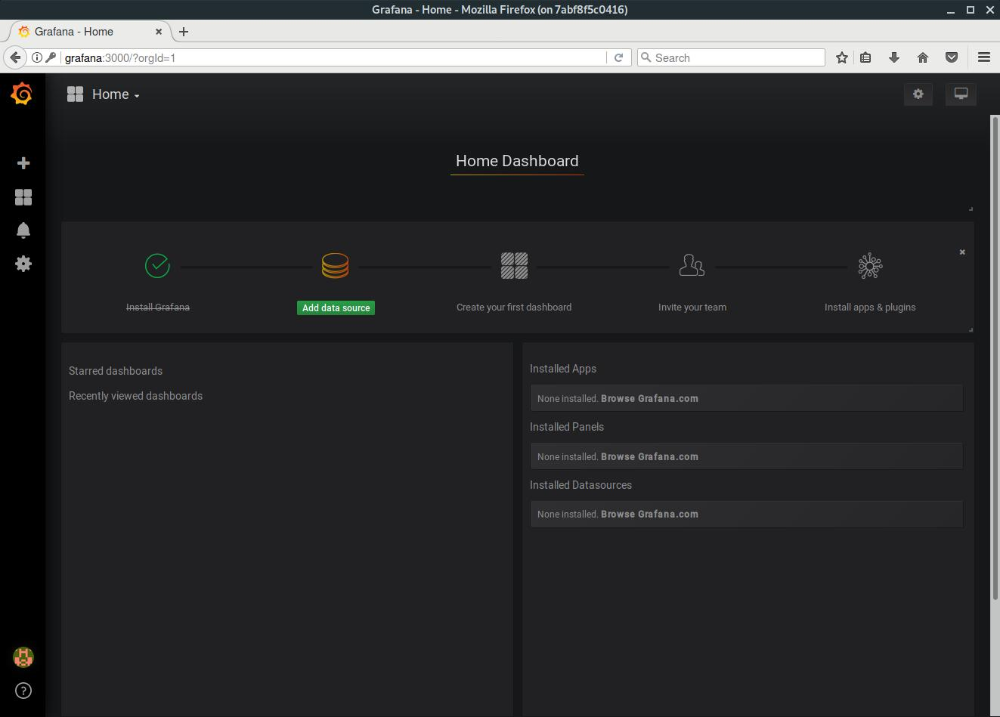
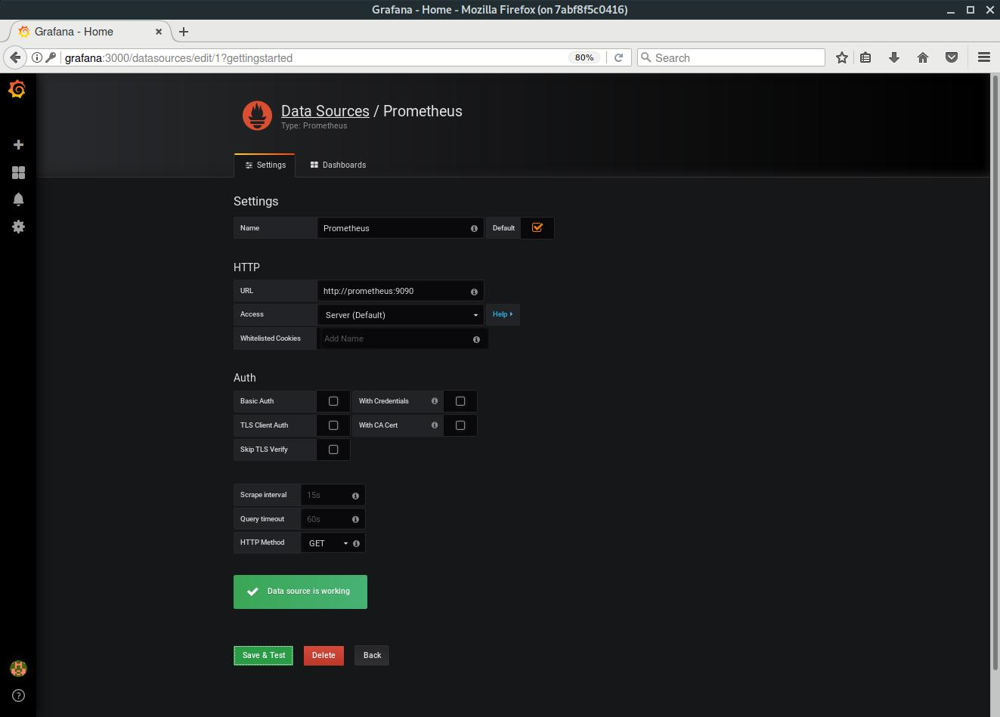
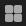
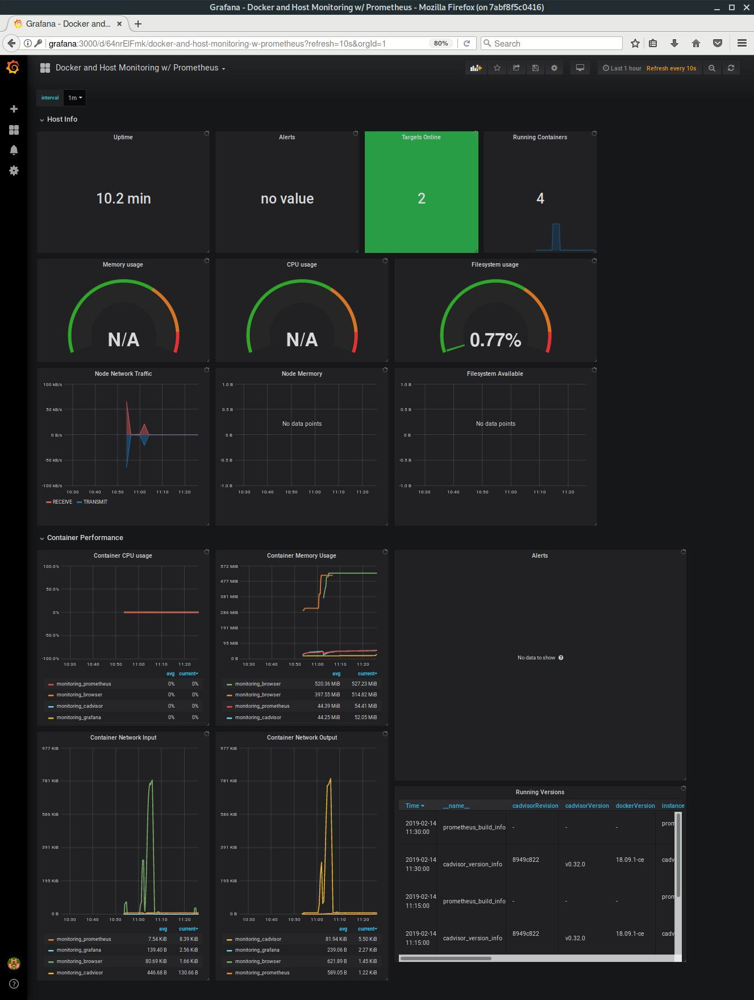
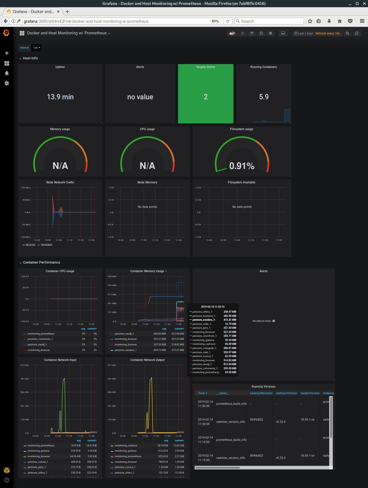
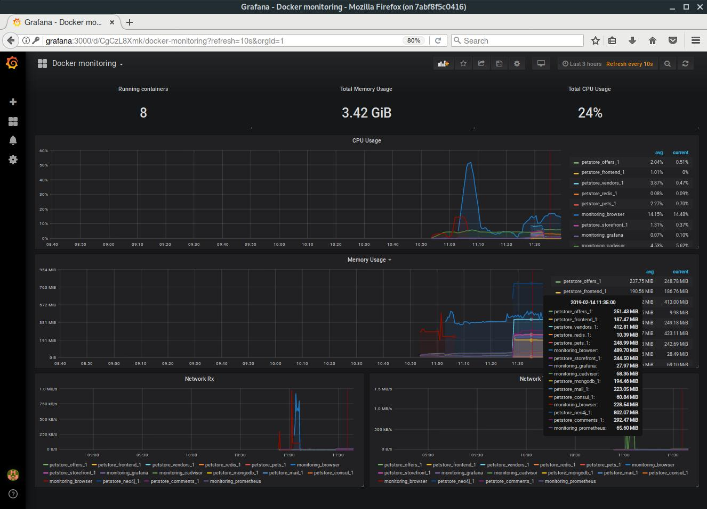

# Local containers metrics using cAdvisor, Prometheus and Grafana

Docker monitoring snippet based on the post '[Monitorer ses containers Docker](https://blog.eleven-labs.com/fr/monitorer-ses-containers-docker/)'.

## Stack

[cAdvisor](https://github.com/google/cadvisor) will present an endpoint *http://cadvisor:8080/metrics* with all container metrics at time _<t>_.

[Prometheus](https://github.com/prometheus/prometheus) will request the endpoint of cAdvisor every _<x>_ seconds and store the metrics in its database.

[Grafana](https://github.com/grafana/grafana) will display Prometheus metrics in graph form.

[Firefox Browser](https://hub.docker.com/r/ellerbrock/alpine-firefox/dockerfile) based on Alpine Linux sharing X11 

*docker* and *docker-composer* are required. The used version are:

```bash
$ docker --version; docker-compose --version
Docker version 18.09.1-ce, build 4c52b901c6
docker-compose version 1.23.2, build unknown
```

## Snippet

The [snippet](./docker-compose.yml) defines the custom network name '**containers_monitoring**' using the special network driver under name _[bridge](launch-a-container-on-the-default-network)_. Unless you tell it otherwise, Docker always launches your containers in this network.

Running _docker-compose_ at **root** folder (add -d for running in background)

```bash
$ docker-compose up
Recreating grafana          ... done
Recreating cadvisor         ... done
Recreating prometheus       ... done
Creating monitoring_browser ... done
Attaching to monitoring_browser, monitoring_grafana, monitoring_prometheus, monitoring_cadvisor
monitoring_browser | [s6-init] making user provided files available at /var/run/s6/etc...exited 0.
...
```
will show a browser window like this



Before define the Grafana dashboard you can take a look to cAdvisor and Prometheus dashboards as follow

[cAdvisor dashboard](http://cadvisor:8080/containers/docker) shows



and [Prometheus targets](http://prometheus:9090/targets)



As all is running up let's go to set [Grafana](http://grafana:3000/login) Dashboard.

## Grafana config

Login process requires username and password (defaults are admin/admin) and change the last one to get _Home Dashboard_ panel



The first step is create the Prometheus data source as follow:
- Click on 'Add data source'
- Choose **Prometheus** as data source type
- Optionally change the default name
- Default must be checked
- Set URL to Prometheus service 'http://prometheus:9090'
- Click on 'Save & Test' button

and you get something like



You are now ready to create your first dashboard from the information collected by Prometheus. 
You can also import some dashboards from a collection of [shared dashboards](https://grafana.com/dashboards?dataSource=prometheus).

For our snippet we will go to import this one [Docker and Host Monitoring w/ Prometheus](https://grafana.com/dashboards/179) as follow:
- Click on  at left bar and 'Manage option' to create a new dashboard
- Click on '+ Import' button
- Set 'Grafana.com Dashboard' text box with the URL 'https://grafana.com/dashboards/179'
- Click on 'Load' button
- Set 'Prometheus' option with before defined data source
- Click on 'Import' button

And voilá, you should have your first dashboard 

    

The dashboard should show all running container that use the network _bridge_ driver.

By example, using the [Micronaut](https://micronaut.io/) [Petstore example](https://github.com/micronaut-projects/micronaut-examples/tree/master/petstore) the dashboard will show something as



Now, it's time to play importing a new dashboard as [Docker monitoring](https://grafana.com/dashboards/193)



or whatever you need. Don't forget there also cAdvisor and Prometheus are running ... obviously.

That's all folks!!!. I hope it's helpful.